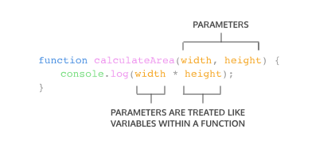
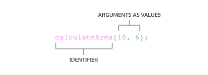
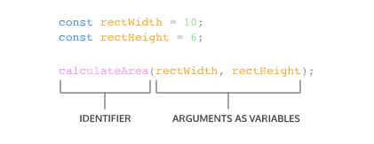
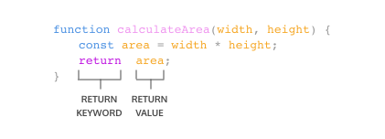
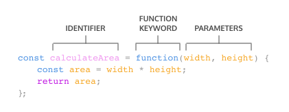
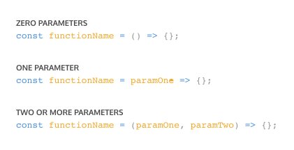
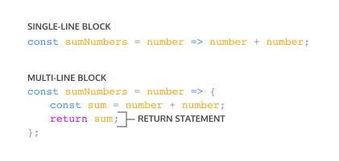

# Learn JavaScript: Functions and Scope

Date: September 20, 2026
Link: https://www.codecademy.com/learn/learn-javascript-functions-and-scope
Status: Done

# Functions

## **What Are Functions?**

When first learning how to calculate the area of a rectangle, there’s a sequence of steps to calculate the correct answer:

1. Measure the width of the rectangle.
2. Measure the height of the rectangle.
3. Multiply the width and height of the rectangle.

With practice, you can calculate the area of the rectangle without being instructed on these three steps every time.

We can calculate the area of a rectangle with the following code:

```jsx
const width = 10;
const height = 6;
const area = width * height;
console.log(area); // Output: 60
```

Imagine being asked to calculate the area of three different rectangles:

```jsx
// Area of the first rectangle
const width1 = 10;
const height1 = 6;
const area1 = width1 * height1;

// Area of the second rectangle
const width2 = 4;
const height2 = 9;
const area2 = width2 * height2;

// Area of the third rectangle
const width3 = 10;
const height3 = 10;
const area3 = width3 * height3;
```

In programming, *we often use code to perform a specific task multiple times*. Instead of rewriting the same code, we can group a block of code together and associate it with one task, then we can reuse that block of code whenever we need to perform the task again. We achieve this by creating a function.

> A **function** is a reusable block of code that groups together a sequence of statements to perform a specific task.
> 

## **Function Declarations**

In JavaScript, there are many ways to create a function. One way to create a function is by using a **function declaration**. Just like how a variable declaration binds a value to a variable name, a function declaration binds a function to a name, or an **identifier**. Take a look at the anatomy of a function declaration below:


A function declaration consists of:

- The `function` keyword
- The name of the function, or its identifier, followed by parentheses
- A function body, or the block of [statements](https://www.codecademy.com/resources/docs/javascript/statements) required to perform a specific task, enclosed in the function’s curly brackets, `{ }`

A function declaration is a function that is bound to an identifier, or name. In the next exercise, we’ll go over how to run the code inside the function body.

We should also be aware of the **hoisting** feature in JavaScript, which allows access to function declarations before they’re defined.

Take a look at an example of hoisting:

```jsx
greetWorld(); // Output: Hello, World!

function greetWorld() {
  console.log('Hello, World!');
}
```

Notice how hoisting allowed `greetWorld()` to be called before the `greetWorld()` function was defined! Since hoisting isn’t considered good practice, we simply want to point out this feature.

To read more about hoisting, check out [MDN documentation on hoisting](https://developer.mozilla.org/en-US/docs/Glossary/Hoisting).

## **Calling a Function**

As we saw in previous exercises, a function declaration binds a function to an identifier.

However, a function declaration does not ask the code inside the function body to run, it just declares the existence of the function. The code inside a function body runs, or *executes*, only when the function is *called*.

To **call a function**, type the function name followed by parentheses.


This **function call** executes the function body, or all of the **statements** between the curly braces in the function declaration.


We can call the same function as many times as needed.

## **Parameters and Arguments**

So far, the functions we’ve created execute a task without an input. However, some functions can take inputs and use the inputs to perform a task. When declaring a function, we can specify its **parameters**.

Parameters allow functions to accept input(s) and perform a task using the input(s). We use parameters as placeholders for information that will be passed to the function when it is called.

Let’s observe how to specify parameters in our function declaration:



In the diagram above, `calculateArea()` computes the area of a rectangle, based on two inputs, `width` and `height`. The parameters are specified between the parentheses as `width` and `height`, and inside the function body, they act just like regular variables. The parameters `width` and `height` act as placeholders for values that will be multiplied together.

When calling a function that has parameters, we specify the values in the parentheses that follow the function name. The values that are passed to the function when it is called are called **arguments**. Arguments can be passed to the function as values or variables.



In the function call above, the number `10` is passed as the `width` and `6` is passed as the `height`. Notice that the order in which arguments are passed and assigned follows the order in which the parameters are declared.



The variables `rectWidth` and `rectHeight` are initialized with the values for the height and width of a rectangle before being used in the function call.

By using parameters, `calculateArea()` can be reused to compute the area of any rectangle! Functions are a powerful tool in computer programming, so let’s practice creating and calling functions with parameters.

## **Default Parameters**

One of the features added in ES6 is the ability to use **default parameters**. Default parameters allow parameters to have a predetermined value in case no argument is passed into the function or if the argument is `undefined` when called.

Take a look at the code snippet below that uses a default parameter:

```jsx
function greeting(name = 'stranger') {
  console.log(`Hello,${name}!`)
}

greeting('Nick') // Output: Hello, Nick!
greeting()       // Output: Hello, stranger!
```

- In the example above, we used the `=` operator to assign the parameter `name` a default value of `'stranger'`. This is useful to have in case we ever want to include a non-personalized default greeting!
- When the code calls `greeting('Nick')`, the value of the argument is passed in and `'Nick'`, will override the default parameter of `'stranger'` to log `'Hello, Nick!'` to the console.
- When there isn’t an argument passed into `greeting()`, the default value of `'stranger'` is used, and `'Hello, stranger!'` is logged to the console.

By using a default parameter, we account for situations when an argument isn’t passed into a function that is expecting an argument.

Let’s practice creating functions that use default parameters.

## **Return**

When a function is called, the computer will run through the function’s code and evaluate the result. By default, the resulting value is `undefined`.

```jsx
function rectangleArea(width, height) {
	let area = width * height;
}
console.log(rectangleArea(5, 7)) // Prints undefined
```

In the code example, we defined our function to calculate the `area` of a `width` and `height` parameter. Then `rectangleArea()` is invoked with the arguments `5` and `7`. But when we went to print the results, we got `undefined`. Did we write our function wrong? No! In fact, the function worked fine, and the computer did calculate the area as `35`, but we didn’t capture it. So how can we do that? With the keyword `return`!



To pass back information from the function call, we use a return statement. To create a return statement, we use the `return` keyword followed by the value that we wish to return. Like we saw above, if the value is omitted, `undefined` is returned instead.

When a `return` statement is used in a function body, the execution of the function is stopped, and the code that follows it will not be executed. Look at the example below:

```jsx
function rectangleArea(width, height) {
	if (width < 0 || height < 0) {
			return 'You need positive integers to calculate area!';
	}
	return width * height;
}
```

If an argument for `width` or `height` is less than `0`, then `rectangleArea()` will return `'You need positive integers to calculate area!'`. The second return statement — `width * height` — will not run.

The `return` keyword is powerful because it allows functions to produce an output. We can then save the output to a variable for later use.

## **Helper Functions**

We can also use the return value of a function inside another function. These functions being called within another function are often referred to as **helper functions**. Since each function is carrying out a specific task, it makes our code easier to read and debug if necessary.

If we wanted to define a function that converts the temperature from Celsius to Fahrenheit, we could write two functions like:

```jsx
function multiplyByNineFifths(number) {
	return number * (9/5);
};

function getFahrenheit(celsius) {
	return multiplyByNineFifths(celsius) + 32;
};

getFahrenheit(15); // Returns 59

```

In the example above:

- `getFahrenheit()` is called with `15` passed as an argument.
- The code block inside of `getFahrenheit()` calls `multiplyByNineFifths()` and passes `15` as an argument.
- `multiplyByNineFifths()` takes the argument of `15` for the `number` parameter.
- The code block inside of `multiplyByNineFifths()` function multiplies `15` by `(9/5)`, which evaluates to `27`.
- `27` is returned to the function call in `getFahrenheit()`.
- `getFahrenheit()` continues to execute. It adds `32` to `27`, which evaluates to `59`.
- Finally, `59` is returned to the function call `getFahrenheit(15)`.

We can use functions to section off small bits of logic or tasks and then use them when necessary. Writing helper functions can help break large and difficult tasks into smaller and more manageable tasks.

## **Function Expressions**

Another way to define a function is to use a **function expression**. To define a function inside an expression, we can use the `function` keyword. In a function expression, the function name is usually omitted. A function with no name is called an **anonymous function**. A function expression is often stored in a variable in order to refer to it.

Consider the following function expression:



To declare a function expression:

1. Declare a variable to make the variable’s name the name, or identifier, of the function. Since the release of ES6, it is common practice to use `const` as the keyword to declare a variable.
2. Assign as that variable’s value an anonymous function created by using the `function` keyword followed by a set of parentheses with possible parameters. Then a set of curly braces that contains the function body.

To invoke a function expression, write the name of the variable in which the function is stored, followed by parentheses enclosing any arguments being passed into the function.

```jsx
variableName(argument1, argument2)
```

Unlike function declarations, function expressions are not hoisted, so they cannot be called before they are defined.

Let’s define a new function using a function expression.

## **Arrow Functions**

ES6 introduced **arrow function** syntax, a shorter way to write functions by using the special “fat arrow” `() =>` notation.

**Arrow functions** remove the need to type out the keyword `function` every time we create a function. Instead, we first include the parameters inside the `( )` and then add an arrow `=>` that points to the function body surrounded in `{ }` like this:

```jsx
const rectangleArea = (width, height) => {
	let area= width* height;
	return area;
};
```

It’s important to be familiar with the multiple ways of writing functions, as we will likely encounter each of these when reading other JavaScript code.

## **Concise Body Arrow Functions**

JavaScript also provides several ways to refactor arrow function syntax. The most condensed form of the function is known as a **concise body**. We’ll explore a few of these techniques below:

1. **Functions that take only a single parameter** do not need that parameter to be enclosed in parentheses. However, if a function takes zero or multiple parameters, parentheses are required.
    
    
    
2. **A function body composed of a single-line block** does not need curly braces. Without the curly braces, whatever that line evaluates will be automatically returned. The contents of the block should immediately follow the arrow `=>`, and the `return` keyword can be removed. This is referred to as **implicit return**.
    
    
    

So if we have a function:

```jsx
const squareNum = (num) => {
	return num * num;
};
```

We can refactor the function to:

```jsx
const squareNum = num => num * num;
```

Notice the following changes:

- The parentheses around `num` have been removed, since it has a single parameter.
- The curly braces `{ }` have been removed since the function consists of a single-line block.
- The `return` keyword has been removed since the function consists of a single-line block.

## **Review Functions**

Give yourself a pat on the back, you just navigated through functions!

In this lesson, we covered some important concepts about functions:

- A **function** is a reusable block of code that groups together a sequence of [statements](https://www.codecademy.com/resources/docs/javascript/statements) to perform a specific task.
    
    Preview: Docs In JavaScript, a statement is a unit of code that performs a specific action or task.
    
- A **function declaration** :
    
    
    
- A **parameter** is a named variable inside a function’s block, which will be assigned the value of the **argument** passed in when the function is invoked:
    
    ![A diagram illustrating how function parameters work in JavaScript. It shows the function declaration 'function calculateArea(width, height) { console.log(width * height); }' with 'PARAMETERS' labeled at the top pointing to 'width, height' in the function signature. Below, brackets point to 'width' and 'height' where they're used inside the function body (in the console.log statement), with the caption 'PARAMETERS ARE TREATED LIKE VARIABLES WITHIN A FUNCTION'. The diagram demonstrates that parameters defined in the function signature can be used as variables throughout the function body.](https://content.codecademy.com/courses/learn-javascript-functions/Diagram/function_parameters.svg)
    
- To **call** a function in your code:
    
    
    
- ES6 introduces new ways of handling arbitrary parameters through **default parameters** which allow us to assign a default value to a parameter in case no argument is passed into the function.
- To return a value from a function, we use a **return statement**.
- To define a function using **function expressions**:
    
    ![A diagram showing the anatomy of a JavaScript function expression. It displays the code 'const calculateArea = function(width, height) { const area = width * height; return area; };' with three labeled components: 'IDENTIFIER' points to 'calculateArea', 'FUNCTION KEYWORD' points to 'function', and 'PARAMETERS' points to 'width, height' inside the parentheses. The diagram illustrates how a function expression is assigned to a constant variable, showing the function's parameters and body that calculates and returns the product of width and height.](https://content.codecademy.com/courses/learn-javascript-functions/Diagram/expression.svg)
    
- To define a function using **arrow function notation**:
    
    ![A diagram illustrating the anatomy of a JavaScript arrow function. It shows the code 'const calculateArea = (width, height) => { const area = width * height; return area; };' with three labeled components: 'IDENTIFIER' points to 'calculateArea', 'PARAMETERS' points to '(width, height)', and 'ARROW' points to the '=>' symbol. The diagram demonstrates the structure of an arrow function expression assigned to a constant variable, showing how the arrow syntax replaces the function keyword in this modern JavaScript syntax.](https://content.codecademy.com/courses/learn-javascript-functions/Diagram/arrow_notation.svg)
    
- Function definition can be made concise using **concise arrow notation**:
    
    ![A diagram comparing two arrow function syntax styles in JavaScript. The first section labeled 'SINGLE-LINE BLOCK' shows 'const sumNumbers = number => number + number;' demonstrating a concise arrow function without curly braces that implicitly returns the result. The second section labeled 'MULTI-LINE BLOCK' shows 'const sumNumbers = number => { const sum = number + number; return sum; };' with curly braces containing multiple statements. A bracket points to 'return sum;' with the label 'RETURN STATEMENT', illustrating that multi-line [arrow functions](https://www.codecademy.com/resources/docs/javascript/arrow-functions) require an explicit return statement unlike single-line versions.](https://content.codecademy.com/courses/learn-javascript-functions/Diagram/return.svg)
    

It’s good to be aware of the differences between function expressions, arrow functions, and function declarations. As you program more in JavaScript, you’ll see a wide variety of how these function types are used.

# Scope

## **Scope**

An important idea in programming is scope. **Scope** defines where variables can be accessed or referenced. While some variables can be accessed from anywhere within a program, other variables may only be available in a specific context.

You can think of scope like the view of the night sky from your window. Everyone who lives on the planet Earth is in the global scope of the stars. The stars are accessible **globally**. Meanwhile, if you live in a city, you may see the city skyline or the river. The skyline and river are only accessible **locally** in your city, but you can still see the stars that are available globally.

Over the next few exercises, we’ll explore how scope relates to variables and learn best practices for variable declaration.

## **Blocks and Scope**

Before we talk more about scope, we first need to talk about **blocks**.

We’ve seen blocks used before in functions and `if` statements. A block is the code found inside a set of curly braces `{}`. Blocks help us group one or more statements together and serve as an important structural marker for our code.

A function contains a block of code as its body, like this:

```jsx
const logSkyColor = () => {
letcolor = 'blue';
  console.log(color); // blue
}
```

Notice that the function body is actually a block of code.

Observe the block in an `if` statement:

```jsx
if (dusk) {
let color = 'pink';
  console.log(color); // pink
}
```

In the next few exercises, we’ll see how blocks define the scope of variables.

## **Global Scope**

Scope is the context in which our variables are declared. We think about scope in relation to blocks because variables can exist either outside of or within these blocks.

In the **global scope**, variables are declared outside of blocks. These variables are called **global variables**. Because global variables are not bound inside a block, they can be accessed by any code in the program, including code in blocks.

Let’s take a look at an example of global scope:

```jsx
const color = 'blue';
const returnSkyColor = () => {return color  // blue};
console.log(returnSkyColor());              // blue
```

Even though the `color` variable is defined outside of the function, it can still be accessed inside the `returnSkyColor()` function.

Let’s work with global variables to see how data can be accessible from any place within a program.

## **Block Scope / Local Variables**

The next context we’ll cover is block scope. When a variable is defined inside a block, it is only accessible to the code within the curly braces `{}`. We say that a variable has **block scope** because it is *only* accessible to the lines of code within that block.

Variables declared with block scope are known as **local variables** because they are only available to the code that is part of the same block.

Block scope works like this:

```jsx
const logSkyColor = () = > {
	let color = 'blue';
  console.log(color); // Prints "blue"
};

logSkyColor(); // Prints "blue"
console.log(color); // throws a ReferenceError
```

Notice the following:

- We define a function `logSkyColor()`.
- Within the function, the `color` variable is only available within the curly braces of the function.
- If we try to log the same variable outside the function, it throws a `ReferenceError`.

## **Scope Pollution**

It may seem like a great idea to always make variables globally accessible, but having too many global variables can cause problems in a program.

When declaring global variables, they go to the **global namespace**. The global namespace allows the variables to be accessible from anywhere in the program. These variables remain there until the program finishes, which means our global namespace can fill up really quickly.

**Scope pollution** occurs when we have too many variables in the global namespace, or when we reuse variables across different scopes. Scope pollution makes it difficult to keep track of our different variables and **sets** us up for potential accidents. For example, globally scoped variables can collide with other variables that are more locally scoped, causing unexpected behavior in our code.

Let’s look at an example of scope pollution in practice so we know how to avoid it:

```jsx
let num = 50;

const logNum = () => {
  num = 100; // Take note of this line of code
  console.log(num);
};

logNum(); // Prints 100
console.log(num); // Prints 100
```

Notice that:

- We have a variable `num`.
- Inside the function body of `logNum()`, we want to declare a new variable, but forgot to use the `let` keyword.
- When we call `logNum()`, `num` gets reassigned to `100`.
- The reassignment inside `logNum()` affects the global variable `num`.
- Even though the reassignment is allowed and we won’t get an error, if we decide to use `num` later, we’ll unknowingly use the new value of `num`.

While it’s important to know what global scope is, it’s best practice to not define variables in the global scope when possible.

## **Practice Good Scoping**

Given the challenges with **global variables** and scope pollution, we should follow best practices for scoping our variables as tightly as possible using block scope.

**Tightly scoping** variables will greatly improve code in several ways:

- It will make the code more legible since the blocks will organize the code into discrete sections.
- It makes the code more understandable by clarifying which variables are associated with different parts of the program, rather than having to keep track of them line by line!
- It’s easier to maintain tightly scoped code, as it will be modular.
- It will save memory because variables with block scope will cease to exist after the block finishes running.

Here’s another example of how block scope works, as defined within an `if` block:

```jsx
const logSkyColor = () => {
	const dusk = true;
	let color ='blue';
	if (dusk) {
		let color = 'pink';
    console.log(color); // Prints "pink"
	}
  console.log(color);// Prints "blue"
};

console.log(color); // throws a ReferenceError
```

Here, notice that:

- We create a variable `color` inside the `logSkyColor()` function.
- After the `if` statement, we create a new block with `{ }` braces, where we declare a new `color` variable using `let` and assign it a value if the `if` condition is truthy.
- Within the `if` block, the `color` variable holds the value `'pink'`, though outside the `if` block, in the function body, the `color` variable holds the value `'blue'`.
- On the last line, we attempt to print the value of `color` outside both the `if` statement and the definition of `logSkyColor()`. This will throw a `ReferenceError` since `color` only exists within the scope of those two blocks — it is never defined in the global scope.
- While we use block scope, we still pollute our namespace by reusing the same variable name twice. A better practice would be to rename the variable inside the block.

Block scope is a powerful tool in JavaScript, since it allows us to define variables with precision and not pollute the global namespace. If a variable does not need to exist outside a block, it shouldn’t!

## **Review**

In this lesson, you learned about scope and how it impacts the accessibility of different variables Preview: Docs Loading link description.

Let’s review the following terms:

- **Scope** refers to where variables can be accessed throughout the program, and is determined by where and how they are declared.
- **Blocks** are [statements](https://www.codecademy.com/resources/docs/javascript/statements) that exist within curly braces `{}`.
    
    Preview: Docs Loading link description
    
- **Global scope** refers to the context within which variables are accessible to every part of the program.
- **Global variables** are variables that exist within the global scope.
- **Block scope** refers to the limited reach of variables that are only available within the specific code block where they are defined.
- **Local variables** are variables that exist within the block scope.
- **Global namespace** is the space in our code that contains globally scoped information.
- **Scope pollution** is when too many variables exist in a namespace or variable names are reused.

As you continue your coding journey, remember to use best practices when declaring your variables! Scoping your variables tightly will ensure that your code has clean, organized, and modular logic.